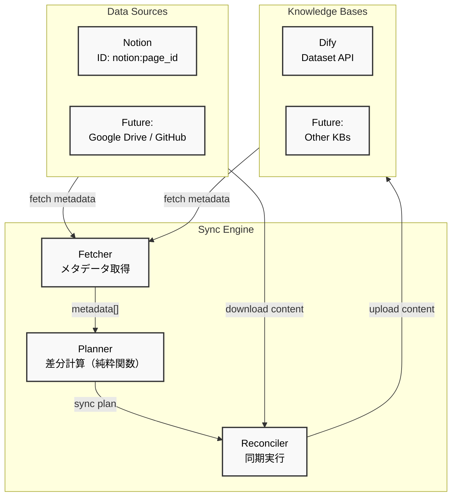

# AI Knowledge ETL Framework 設計書

## 1. 設計原則

### 1.1 冪等性 (Idempotency)

本フレームワークは、**冪等な実行**を最重要原則として設計されています。

- **障害からの自動復旧**: サーバーやネットワークの不具合で異常終了しても、再実行により望ましい状態に収束
- **Plan/Apply方式**: Terraformのように、まず実行計画(Plan)を生成し、それを適用(Apply)する2段階実行
- **オンメモリプランニング**: Planはファイルではなくメモリ上で管理し、高速に処理

### 1.2 純粋関数ベースの設計

- **副作用の分離**: ビジネスロジックは純粋関数として実装し、I/O操作から分離
- **テスタビリティ**: 純粋関数により単体テストが容易
- **予測可能性**: 同じ入力に対して常に同じ出力を保証

### 1.3 効率的なリソース管理

- **メタデータのみでの計画生成**: Plannerは文書本体に一切依存せず、メタデータ（ID、最終更新日時）のみで同期計画を生成
- **計画と実行の分離**: 同期計画の生成時には文書内容を扱わず、実行時にのみ必要な文書を処理
- **遅延ダウンロード**: 実際にcreate/updateが必要な文書のみ、実行時に取得・変換
- **プロバイダー固有の処理**: NotionのようにMarkdown変換が必要な場合も、Reconciler実行時にのみ処理
- **自動クリーンアップ**: 処理完了後、一時ファイルを自動削除

## 2. アーキテクチャ概要

### 2.1 全体構成



### 2.2 コンポーネント設計

#### Core Components

1. **Config Manager**
   - YAML設定ファイルの読み込み
   - 環境変数の管理
   - バリデーション

2. **Fetcher Layer** (I/O層)
   - Data Sourceから現在のドキュメントのメタデータ一覧を取得
   - Knowledge Providerから現在のドキュメントのメタデータ一覧を取得
   - **文書本体は取得せず**、メタデータ（ID、最終更新日時）のみ取得

3. **Planner Layer** (純粋関数層)
   - 両側のメタデータ一覧を突合
   - **メタデータのみで**実行計画（SyncPlan）を生成
   - 最終更新日時の比較により操作を決定: create, update, delete, skip

4. **Reconciler Layer** (I/O層)
   - SyncPlanに基づいて実際の操作を実行
   - **create/update対象の文書のみ**、実行時に取得・処理
   - **プロバイダー固有の実装**: Notionはblocks→Markdown変換、Google Driveは直接ファイル取得など
   - エラーハンドリングとリトライ
   - 一時ファイルの自動クリーンアップ
   - 進捗状況の追跡

5. **Provider実装**
   - NotionとDifyの直接実装
   - ID管理とメタデータ追跡

## 3. 同期戦略

### 3.1 ドキュメントの識別

- **一意識別子 (ID)**: Data SourceとKnowledge Provider間で同じドキュメントを識別
- **ID生成戦略**:
  - フォーマット: `<data-source-provider-id>:<original-id>`
  - 例:
    - Notion: `notion:<page_id>`
    - Google Drive: `google-drive:<file_id>`
    - GitHub: `github:<repository>/<file_path>`
- **Data Source Provider ID**: データソースを一意に識別する文字列（例: `notion`, `google-drive`, `github`）
- **設計思想**:
  - ドキュメントの一意性はデータソース内でのみ保証
  - 同一コンテンツが異なるデータソース間で移動した場合は、別のドキュメントとして扱う

### 3.2 同期ロジック

- **メタデータのみで効率的に計画生成**
- **文書本体は計画時点では取得しない**
- **最終更新日時の比較のみで更新要否を判断**

```typescript
// 純粋関数として実装される同期計画生成（メタデータのみ）
function generateSyncPlan(
  sourceMetadata: DocumentMetadata[],
  knowledgeMetadata: DocumentMetadata[],
): SyncPlan {
  const operations: SyncOperation[] = [];

  // 1. Create: ソースにあってナレッジにない
  // 2. Update: 両方にあり、ソースの方が新しい（lastModified比較）
  // 3. Delete: ナレッジにあってソースにない
  // 4. Skip: 両方にあり、更新不要

  return { operations };
}
```

## 4. ディレクトリ構造

```
dok/
├── src/
│   ├── index.ts                 # エントリーポイント
│   ├── cli.ts                   # CLIインターフェース
│   ├── config/
│   │   ├── index.ts            # 設定管理
│   │   └── schema.ts           # 設定スキーマ定義
│   ├── core/
│   │   ├── engine.ts           # ETLエンジン（メイン実行フロー）
│   │   ├── fetcher.ts          # 状態取得ロジック
│   │   ├── planner.ts          # 同期計画生成（純粋関数）
│   │   ├── reconciler.ts       # 計画実行ロジック
│   │   ├── types.ts            # 共通型定義
│   │   └── operations.ts       # 操作定義（create/update/delete/skip）
│   ├── providers/
│   │   ├── data_source/
│   │   │   └── notion.ts       # Notion Data Source Provider
│   │   └── knowledge/
│   │       └── dify.ts         # Dify Knowledge Provider
│   ├── utils/
│   │   ├── logger.ts           # ログユーティリティ
│   │   ├── error.ts            # エラーハンドリング
│   │   ├── retry.ts            # リトライロジック
│   │   └── tempfile.ts         # 一時ファイル管理
│   └── tests/
│       ├── planner.test.ts     # 同期計画生成のテスト
│       └── fixtures/           # テストデータ
├── config.yaml                 # 設定ファイル例
├── package.json
├── pnpm-lock.yaml
├── tsconfig.json
├── biome.json
└── .prettierrc
```

## 5. インターフェース設計

### 5.1 Core Types

```typescript
// Provider共通インターフェース
interface DataSourceProvider {
  providerId: string;
  initialize(config: Record<string, any>): Promise<void>;
  fetchDocumentsMetadata():
    | AsyncIterator<DocumentMetadata>
    | Promise<DocumentMetadata[]>;
  downloadDocumentContent(documentId: string): Promise<string>; // 一時ファイルパスを返す
}

interface KnowledgeProvider {
  initialize(config: Record<string, any>): Promise<void>;
  fetchDocumentsMetadata(): Promise<DocumentMetadata[]>;
  createDocumentFromFile(
    metadata: DocumentMetadata,
    filePath: string,
  ): Promise<void>;
  updateDocumentFromFile(
    metadata: DocumentMetadata,
    filePath: string,
  ): Promise<void>;
  deleteDocument(documentId: string): Promise<void>;
}

// DocumentMetadata型定義（これのみを使用、contentは扱わない）
interface DocumentMetadata {
  id: string; // 一意識別子（format: <provider-id>:<original-id>）
  sourceId: string; // ソース側の元ID（プロバイダー固有のID）
  providerId: string; // Data Source Provider ID（例: 'notion', 'google-drive'）
  title: string;
  lastModified: Date; // 更新判定に使用（これが同期の要）
}

// 一時ファイル処理用の型
interface TempFileResult {
  metadata: DocumentMetadata;
  filePath: string; // 一時ファイルのパス
}

// 同期操作の定義
type SyncOperationType = "create" | "update" | "delete" | "skip";

interface SyncOperation {
  type: SyncOperationType;
  documentMetadata: DocumentMetadata; // 計画時点ではメタデータのみ
  reason: string; // 操作の理由（ログ用）
}

// 同期計画
interface SyncPlan {
  operations: SyncOperation[];
  summary: {
    total: number;
    create: number;
    update: number;
    delete: number;
    skip: number;
  };
}

// 実行結果
interface SyncResult {
  operation: SyncOperation;
  success: boolean;
  error?: Error;
  duration: number; // 実行時間（ms）
}
```

### 5.2 Configuration Schema

```typescript
interface Config {
  sources: SourceConfig[];
  knowledges: KnowledgeConfig[];
  options?: {
    dryRun?: boolean;
    logLevel?: "debug" | "info" | "warn" | "error";
  };
}

interface SourceConfig {
  provider: string; // プロバイダー実装クラス名（例: 'NotionProvider'）
  providerId: string; // Data Source Provider ID（例: 'notion', 'google-drive'）
  config: Record<string, any>; // プロバイダー固有の設定
}

interface KnowledgeConfig {
  provider: string; // プロバイダー実装クラス名（例: 'DifyProvider'）
  config: Record<string, any>; // プロバイダー固有の設定
}
```

## 6. 実装詳細

### 6.1 Notion Provider

```typescript
export class NotionProvider implements DataSourceProvider {
  providerId = "notion";
  private client: Client;
  private databaseId: string;

  async initialize(config: NotionConfig): Promise<void> {
    this.client = new Client({ auth: process.env.NOTION_API_KEY });
    this.databaseId = config.database_id;
  }

  async *fetchDocumentsMetadata(): AsyncIterator<DocumentMetadata> {
    // ページネーション対応でデータベースからメタデータのみ取得
    const pages = await this.client.databases.query({
      database_id: this.databaseId,
    });

    for (const page of pages.results) {
      yield {
        id: `notion:${page.id}`, // 標準化されたID形式
        sourceId: page.id, // Notion固有のページID
        providerId: "notion", // Data Source Provider ID
        title: this.extractTitle(page),
        lastModified: new Date(page.last_edited_time),
      };
    }
  }

  async downloadDocumentContent(pageId: string): Promise<string> {
    // ページ本体を取得してMarkdownに変換（この処理はメモリ上で実行）
    const page = await this.client.pages.retrieve({ page_id: pageId });
    const markdown = await this.pageToMarkdown(page);

    // 変換結果を一時ファイルに保存
    const tempPath = path.join(
      os.tmpdir(),
      `notion_${pageId}_${Date.now()}.md`,
    );
    await fs.writeFile(tempPath, markdown);

    return tempPath; // ファイルパスを返す
  }
}
```

### 6.2 Dify Provider

```typescript
export class DifyProvider implements KnowledgeProvider {
  private apiKey: string;
  private baseUrl: string;
  private datasetId: string;

  async initialize(config: DifyConfig): Promise<void> {
    this.apiKey = process.env.DIFY_API_KEY!;
    this.baseUrl = process.env.DIFY_API_BASE_URL!;
    this.datasetId = config.dataset_id;
  }

  async fetchDocumentsMetadata(): Promise<DocumentMetadata[]> {
    // Dify APIから既存ドキュメントのメタデータ一覧を取得
    const response = await axios.get(
      `${this.baseUrl}/datasets/${this.datasetId}/documents`,
      {
        headers: { Authorization: `Bearer ${this.apiKey}` },
      },
    );

    return response.data.map((doc: any) => ({
      id: doc.name, // Data Source側のID（format: <provider-id>:<original-id>）
      sourceId: doc.id, // Dify内部のドキュメントID
      providerId: this.extractProviderId(doc.name), // IDから抽出
      title: doc.title,
      lastModified: new Date(doc.updated_at),
    }));
  }

  private extractProviderId(id: string): string {
    // ID形式: <provider-id>:<original-id> からprovider-idを抽出
    const [providerId] = id.split(":", 2);
    return providerId;
  }

  async createDocumentFromFile(
    metadata: DocumentMetadata,
    filePath: string,
  ): Promise<void> {
    // ファイルから直接アップロード（メモリに載せない）
    const formData = new FormData();
    formData.append("name", metadata.id);
    formData.append("title", metadata.title);
    formData.append("metadata", JSON.stringify(metadata));

    // 一時ファイルからアップロード（大きなファイルでもメモリ効率的）
    const fileStream = fs.createReadStream(filePath);
    formData.append("file", fileStream);

    await axios.post(
      `${this.baseUrl}/datasets/${this.datasetId}/documents`,
      formData,
      {
        headers: {
          Authorization: `Bearer ${this.apiKey}`,
          ...formData.getHeaders(),
        },
      },
    );
  }

  async updateDocumentFromFile(
    metadata: DocumentMetadata,
    filePath: string,
  ): Promise<void> {
    // 既存ドキュメント更新（ファイルから）
    const formData = new FormData();
    formData.append("title", metadata.title);
    formData.append("metadata", JSON.stringify(metadata));

    const fileStream = fs.createReadStream(filePath);
    formData.append("file", fileStream);

    await axios.put(
      `${this.baseUrl}/datasets/${this.datasetId}/documents/${metadata.sourceId}`,
      formData,
      {
        headers: {
          Authorization: `Bearer ${this.apiKey}`,
          ...formData.getHeaders(),
        },
      },
    );
  }

  async deleteDocument(documentId: string): Promise<void> {
    // ドキュメント削除
    await axios.delete(
      `${this.baseUrl}/datasets/${this.datasetId}/documents/${documentId}`,
      {
        headers: { Authorization: `Bearer ${this.apiKey}` },
      },
    );
  }
}
```

### 6.3 Planner (純粋関数層)

```typescript
// 純粋関数として実装される同期計画生成（メタデータのみ使用）
export function generateSyncPlan(
  sourceMetadata: DocumentMetadata[],
  knowledgeMetadata: DocumentMetadata[],
): SyncPlan {
  const sourceMap = new Map(sourceMetadata.map((d) => [d.id, d]));
  const knowledgeMap = new Map(knowledgeMetadata.map((d) => [d.id, d]));
  const operations: SyncOperation[] = [];

  // Create/Update operations
  for (const [id, sourceDoc] of sourceMap) {
    const knowledgeDoc = knowledgeMap.get(id);

    if (!knowledgeDoc) {
      operations.push({
        type: "create",
        documentMetadata: sourceDoc,
        reason: "Document exists in source but not in knowledge",
      });
    } else if (sourceDoc.lastModified > knowledgeDoc.lastModified) {
      operations.push({
        type: "update",
        documentMetadata: sourceDoc,
        reason: `Source document is newer (${sourceDoc.lastModified} > ${knowledgeDoc.lastModified})`,
      });
    } else {
      operations.push({
        type: "skip",
        documentMetadata: sourceDoc,
        reason: "Document is up to date",
      });
    }
  }

  // Delete operations
  for (const [id, knowledgeDoc] of knowledgeMap) {
    if (!sourceMap.has(id)) {
      operations.push({
        type: "delete",
        documentMetadata: knowledgeDoc,
        reason: "Document no longer exists in source",
      });
    }
  }

  // Summary calculation
  const summary = operations.reduce(
    (acc, op) => {
      acc.total++;
      acc[op.type]++;
      return acc;
    },
    { total: 0, create: 0, update: 0, delete: 0, skip: 0 },
  );

  return { operations, summary };
}
```

### 6.4 ETL Engine

```typescript
class ETLEngine {
  async execute(config: Config): Promise<void> {
    // 1. Providerの初期化
    const sourceProvider = await this.initializeSourceProvider(
      config.sources[0],
    );
    const knowledgeProvider = await this.initializeKnowledgeProvider(
      config.knowledges[0],
    );

    // 2. 現在の状態を取得（Fetcher - メタデータのみ）
    logger.info("Fetching current metadata...");
    const sourceMetadata = await this.fetchAllMetadata(sourceProvider);
    const knowledgeMetadata = await knowledgeProvider.fetchDocumentsMetadata();

    // 3. 同期計画を生成（Planner - 純粋関数、メタデータのみ使用）
    logger.info("Generating sync plan...");
    const syncPlan = generateSyncPlan(sourceMetadata, knowledgeMetadata);
    logger.info(`Sync plan summary:`, syncPlan.summary);

    // 4. ドライランモードのチェック
    if (config.options?.dryRun) {
      logger.info("Dry run mode - no changes will be made");
      this.printPlan(syncPlan);
      return;
    }

    // 5. 計画を実行（Reconciler - 必要時のみ文書取得）
    logger.info("Executing sync plan...");
    const results = await this.reconcile(
      syncPlan,
      sourceProvider,
      knowledgeProvider,
    );

    // 6. 結果レポート
    this.reportResults(results);
  }

  private async reconcile(
    plan: SyncPlan,
    sourceProvider: NotionProvider,
    knowledgeProvider: DifyProvider,
  ): Promise<SyncResult[]> {
    const results: SyncResult[] = [];

    for (const operation of plan.operations) {
      if (operation.type === "skip") continue;

      const startTime = Date.now();
      let tempFilePath: string | null = null;

      try {
        switch (operation.type) {
          case "create":
          case "update":
            // ドキュメントを取得・変換し、一時ファイルパスを取得
            tempFilePath = await sourceProvider.downloadDocumentContent(
              operation.documentMetadata.sourceId,
            );

            if (operation.type === "create") {
              await knowledgeProvider.createDocumentFromFile(
                operation.documentMetadata,
                tempFilePath,
              );
            } else {
              await knowledgeProvider.updateDocumentFromFile(
                operation.documentMetadata,
                tempFilePath,
              );
            }
            break;
          case "delete":
            await knowledgeProvider.deleteDocument(
              operation.documentMetadata.id,
            );
            break;
        }

        results.push({
          operation,
          success: true,
          duration: Date.now() - startTime,
        });
      } catch (error) {
        results.push({
          operation,
          success: false,
          error: error as Error,
          duration: Date.now() - startTime,
        });
      } finally {
        // 一時ファイルのクリーンアップ
        if (tempFilePath) {
          try {
            await fs.unlink(tempFilePath);
          } catch {
            // クリーンアップエラーは無視
          }
        }
      }
    }

    return results;
  }
}
```

## 7. エラーハンドリング

- **基本方針**: Plan/Applyベースの冪等な実行により、エラーからの復旧を保証
- **詳細な実装**: 必要に応じて後から追加

## 8. 依存パッケージ

### Production Dependencies

- `@notionhq/client`: Notion API Client
- `axios`: HTTP Client for Dify API
- `form-data`: Multipart form data for file uploads
- `yaml`: YAML Parser
- `zod`: Schema Validation
- `winston`: Logging

### Development Dependencies

- `typescript`: 言語
- `@types/node`: Node.js型定義
- `tsx`: TypeScript実行
- `@biomejs/biome`: コードフォーマッター（TS/JS）
- `prettier`: コードフォーマッター（MD/YAML/JSON）
- `vitest`: テストフレームワーク

## 9. CLIインターフェース

```bash
# 基本実行
dok run --config config.yaml

# ドライラン
dok run --config config.yaml --dry-run

# デバッグモード
dok run --config config.yaml --log-level debug

# ヘルプ
dok --help
```

### 9.1 設定ファイル例

```yaml
# config.yaml
sources:
  - provider: NotionProvider
    providerId: notion
    config:
      database_id: ${NOTION_DATABASE_ID}
      # 必要に応じて追加設定
      filters:
        status: published

knowledges:
  - provider: DifyProvider
    config:
      dataset_id: ${DIFY_DATASET_ID}
      # バッチサイズなどの設定
      batch_size: 10

options:
  dryRun: false
  logLevel: info
  # リトライ設定
  retry:
    maxAttempts: 3
    initialDelay: 1000 # ms
    maxDelay: 10000 # ms
```

### 9.2 実行モード

- **ローカル実行**: `dok run --config config.yaml`
- **GitHub Actions**: ワークフロー内でCLIを実行
- **環境変数**: APIキーなどの機密情報は環境変数で管理

## 10. テスト戦略

### 10.1 純粋関数のユニットテスト

```typescript
// planner.test.ts
import { describe, it, expect } from "vitest";
import { generateSyncPlan } from "../core/planner";

describe("generateSyncPlan", () => {
  it("should create new documents", () => {
    const sourceMetadata: DocumentMetadata[] = [
      {
        id: "doc1",
        sourceId: "page1",
        title: "Test Document",
        lastModified: new Date("2024-01-01"),
        metadata: { sourceType: "notion" },
      },
    ];
    const knowledgeMetadata: DocumentMetadata[] = [];

    const plan = generateSyncPlan(sourceMetadata, knowledgeMetadata);

    expect(plan.operations).toHaveLength(1);
    expect(plan.operations[0].type).toBe("create");
  });

  it("should update outdated documents", () => {
    // テストケース実装
  });

  it("should delete removed documents", () => {
    // テストケース実装
  });
});
```

## 11. 将来の拡張ポイント

1. **新しいData Source Provider**
   - Google Drive
   - GitHub
   - S3

2. **新しいKnowledge Provider**
   - AWS Bedrock Knowledge Base
   - Pinecone
   - Weaviate

3. **変換機能**
   - HTML/PDF → Markdown変換
   - メタデータエンリッチメント
