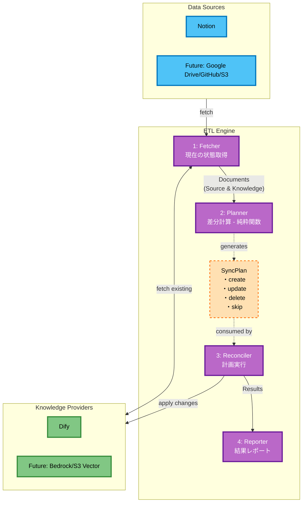

# AI Knowledge ETL Framework 設計書

## 1. 設計原則

### 1.1 冪等性 (Idempotency)

本フレームワークは、**冪等な実行**を最重要原則として設計されています。

- **障害からの自動復旧**: サーバーやネットワークの不具合で異常終了しても、再実行により望ましい状態に収束
- **Plan/Apply方式**: Terraformのように、まず実行計画(Plan)を生成し、それを適用(Apply)する2段階実行
- **オンメモリプランニング**: Planはファイルではなくメモリ上で管理し、高速に処理

### 1.2 純粋関数ベースの設計

- **副作用の分離**: ビジネスロジックは純粋関数として実装し、I/O操作から分離
- **テスタビリティ**: 純粋関数により単体テストが容易
- **予測可能性**: 同じ入力に対して常に同じ出力を保証

## 2. アーキテクチャ概要

### 2.1 全体構成



### 2.2 コンポーネント設計

#### Core Components

1. **Config Manager**
   - YAML設定ファイルの読み込み
   - 環境変数の管理
   - バリデーション

2. **Fetcher Layer** (I/O層)
   - Data Sourceから現在のドキュメント一覧を取得
   - Knowledge Providerから現在のドキュメント一覧を取得
   - メタデータ（ID、最終更新日時）の取得

3. **Planner Layer** (純粋関数層)
   - 両側のドキュメント一覧を突合
   - 実行計画（SyncPlan）の生成
   - 操作の決定: create, update, delete, skip

4. **Reconciler Layer** (I/O層)
   - SyncPlanに基づいて実際の操作を実行
   - エラーハンドリングとリトライ
   - 進捗状況の追跡

5. **Provider実装**
   - NotionとDifyの直接実装
   - ID管理とメタデータ追跡

## 3. 同期戦略

### 3.1 ドキュメントの識別

- **一意識別子 (ID)**: Data SourceとKnowledge Provider間で同じドキュメントを識別
- **ID生成戦略**:
  - Notion: ページIDをそのまま使用
  - Dify: Notion IDをprefixとして使用 (例: `notion_<page_id>`)

### 3.2 同期ロジック

```typescript
// 純粋関数として実装される同期計画生成
function generateSyncPlan(
  sourceDocuments: Document[],
  knowledgeDocuments: Document[],
): SyncPlan {
  const operations: SyncOperation[] = [];

  // 1. Create: ソースにあってナレッジにない
  // 2. Update: 両方にあり、ソースの方が新しい
  // 3. Delete: ナレッジにあってソースにない
  // 4. Skip: 両方にあり、更新不要

  return { operations };
}
```

## 4. ディレクトリ構造

```
dok/
├── src/
│   ├── index.ts                 # エントリーポイント
│   ├── cli.ts                   # CLIインターフェース
│   ├── config/
│   │   ├── index.ts            # 設定管理
│   │   └── schema.ts           # 設定スキーマ定義
│   ├── core/
│   │   ├── engine.ts           # ETLエンジン（メイン実行フロー）
│   │   ├── fetcher.ts          # 状態取得ロジック
│   │   ├── planner.ts          # 同期計画生成（純粋関数）
│   │   ├── reconciler.ts       # 計画実行ロジック
│   │   ├── types.ts            # 共通型定義
│   │   └── operations.ts       # 操作定義（create/update/delete/skip）
│   ├── providers/
│   │   ├── data_source/
│   │   │   └── notion.ts       # Notion Data Source Provider
│   │   └── knowledge/
│   │       └── dify.ts         # Dify Knowledge Provider
│   ├── utils/
│   │   ├── logger.ts           # ログユーティリティ
│   │   ├── error.ts            # エラーハンドリング
│   │   └── retry.ts            # リトライロジック
│   └── tests/
│       ├── planner.test.ts     # 同期計画生成のテスト
│       └── fixtures/           # テストデータ
├── config.yaml                 # 設定ファイル例
├── package.json
├── pnpm-lock.yaml
├── tsconfig.json
├── biome.json
└── .prettierrc
```

## 5. インターフェース設計

### 5.1 Core Types

```typescript
// Document型定義（ID管理とメタデータを強化）
interface Document {
  id: string; // 一意識別子（プロバイダー間で共通）
  sourceId: string; // ソース側の元ID
  title: string;
  content: string;
  lastModified: Date; // 更新判定に使用
  metadata: {
    sourceType: string; // 'notion', 'google-drive', etc.
    contentHash?: string; // コンテンツのハッシュ値（オプション）
    customFields?: Record<string, any>;
  };
}

// 同期操作の定義
type SyncOperationType = "create" | "update" | "delete" | "skip";

interface SyncOperation {
  type: SyncOperationType;
  document: Document;
  reason: string; // 操作の理由（ログ用）
}

// 同期計画
interface SyncPlan {
  operations: SyncOperation[];
  summary: {
    total: number;
    create: number;
    update: number;
    delete: number;
    skip: number;
  };
}

// 実行結果
interface SyncResult {
  operation: SyncOperation;
  success: boolean;
  error?: Error;
  duration: number; // 実行時間（ms）
}
```

### 5.2 Configuration Schema

```typescript
interface Config {
  sources: SourceConfig[];
  knowledges: KnowledgeConfig[];
  options?: {
    dryRun?: boolean;
    logLevel?: "debug" | "info" | "warn" | "error";
  };
}

interface SourceConfig {
  provider: string;
  config: Record<string, any>;
}

interface KnowledgeConfig {
  provider: string;
  config: Record<string, any>;
}
```

## 6. 実装詳細

### 6.1 Notion Provider

```typescript
export class NotionProvider {
  private client: Client;
  private databaseId: string;

  async initialize(config: NotionConfig): Promise<void> {
    this.client = new Client({ auth: process.env.NOTION_API_KEY });
    this.databaseId = config.database_id;
  }

  async *fetchDocuments(): AsyncIterator<Document> {
    // ページネーション対応でデータベースからページを取得
    const pages = await this.client.databases.query({
      database_id: this.databaseId,
    });

    for (const page of pages.results) {
      yield {
        id: `notion_${page.id}`, // Difyとの共通ID
        sourceId: page.id, // Notion元ID
        title: this.extractTitle(page),
        content: await this.pageToMarkdown(page),
        lastModified: new Date(page.last_edited_time),
        metadata: {
          sourceType: "notion",
          customFields: page.properties,
        },
      };
    }
  }
}
```

### 6.2 Dify Provider

```typescript
export class DifyProvider {
  private apiKey: string;
  private baseUrl: string;
  private datasetId: string;

  async initialize(config: DifyConfig): Promise<void> {
    this.apiKey = process.env.DIFY_API_KEY!;
    this.baseUrl = process.env.DIFY_API_BASE_URL!;
    this.datasetId = config.dataset_id;
  }

  async fetchDocuments(): Promise<Document[]> {
    // Dify APIから既存ドキュメント一覧を取得
    const response = await axios.get(
      `${this.baseUrl}/datasets/${this.datasetId}/documents`,
      {
        headers: { Authorization: `Bearer ${this.apiKey}` },
      },
    );

    return response.data.map((doc: any) => ({
      id: doc.name, // Notion IDが格納されている
      sourceId: doc.id,
      title: doc.title,
      content: doc.content,
      lastModified: new Date(doc.updated_at),
      metadata: doc.metadata || {},
    }));
  }

  async createDocument(document: Document): Promise<void> {
    // 新規ドキュメント作成
  }

  async updateDocument(document: Document): Promise<void> {
    // 既存ドキュメント更新
  }

  async deleteDocument(documentId: string): Promise<void> {
    // ドキュメント削除
  }
}
```

### 6.3 Planner (純粋関数層)

```typescript
// 純粋関数として実装される同期計画生成
export function generateSyncPlan(
  sourceDocuments: Document[],
  knowledgeDocuments: Document[],
): SyncPlan {
  const sourceMap = new Map(sourceDocuments.map((d) => [d.id, d]));
  const knowledgeMap = new Map(knowledgeDocuments.map((d) => [d.id, d]));
  const operations: SyncOperation[] = [];

  // Create/Update operations
  for (const [id, sourceDoc] of sourceMap) {
    const knowledgeDoc = knowledgeMap.get(id);

    if (!knowledgeDoc) {
      operations.push({
        type: "create",
        document: sourceDoc,
        reason: "Document exists in source but not in knowledge",
      });
    } else if (sourceDoc.lastModified > knowledgeDoc.lastModified) {
      operations.push({
        type: "update",
        document: sourceDoc,
        reason: `Source document is newer (${sourceDoc.lastModified} > ${knowledgeDoc.lastModified})`,
      });
    } else {
      operations.push({
        type: "skip",
        document: sourceDoc,
        reason: "Document is up to date",
      });
    }
  }

  // Delete operations
  for (const [id, knowledgeDoc] of knowledgeMap) {
    if (!sourceMap.has(id)) {
      operations.push({
        type: "delete",
        document: knowledgeDoc,
        reason: "Document no longer exists in source",
      });
    }
  }

  // Summary calculation
  const summary = operations.reduce(
    (acc, op) => {
      acc.total++;
      acc[op.type]++;
      return acc;
    },
    { total: 0, create: 0, update: 0, delete: 0, skip: 0 },
  );

  return { operations, summary };
}
```

### 6.4 ETL Engine

```typescript
class ETLEngine {
  async execute(config: Config): Promise<void> {
    // 1. Providerの初期化
    const sourceProvider = await this.initializeSourceProvider(
      config.sources[0],
    );
    const knowledgeProvider = await this.initializeKnowledgeProvider(
      config.knowledges[0],
    );

    // 2. 現在の状態を取得（Fetcher）
    logger.info("Fetching current state...");
    const sourceDocuments = await this.fetchAllDocuments(sourceProvider);
    const knowledgeDocuments = await knowledgeProvider.fetchDocuments();

    // 3. 同期計画を生成（Planner - 純粋関数）
    logger.info("Generating sync plan...");
    const syncPlan = generateSyncPlan(sourceDocuments, knowledgeDocuments);
    logger.info(`Sync plan summary:`, syncPlan.summary);

    // 4. ドライランモードのチェック
    if (config.options?.dryRun) {
      logger.info("Dry run mode - no changes will be made");
      this.printPlan(syncPlan);
      return;
    }

    // 5. 計画を実行（Reconciler）
    logger.info("Executing sync plan...");
    const results = await this.reconcile(syncPlan, knowledgeProvider);

    // 6. 結果レポート
    this.reportResults(results);
  }

  private async reconcile(
    plan: SyncPlan,
    provider: DifyProvider,
  ): Promise<SyncResult[]> {
    const results: SyncResult[] = [];

    for (const operation of plan.operations) {
      if (operation.type === "skip") continue;

      const startTime = Date.now();
      try {
        switch (operation.type) {
          case "create":
            await provider.createDocument(operation.document);
            break;
          case "update":
            await provider.updateDocument(operation.document);
            break;
          case "delete":
            await provider.deleteDocument(operation.document.id);
            break;
        }

        results.push({
          operation,
          success: true,
          duration: Date.now() - startTime,
        });
      } catch (error) {
        results.push({
          operation,
          success: false,
          error: error as Error,
          duration: Date.now() - startTime,
        });
      }
    }

    return results;
  }
}
```

## 7. エラーハンドリング

### 7.1 エラー戦略

- **Transient Errors**: 自動リトライ（最大3回）
- **Permanent Errors**: ログ記録して継続
- **Fatal Errors**: 処理中断

### 7.2 ログ設計

- 構造化ログ（JSON形式）
- ログレベル: debug, info, warn, error
- 進捗状況の定期的な出力

## 8. 依存パッケージ

### Production Dependencies

- `@notionhq/client`: Notion API Client
- `axios`: HTTP Client for Dify API
- `yaml`: YAML Parser
- `zod`: Schema Validation
- `winston`: Logging

### Development Dependencies

- `typescript`: 言語
- `@types/node`: Node.js型定義
- `tsx`: TypeScript実行
- `@biomejs/biome`: コードフォーマッター（TS/JS）
- `prettier`: コードフォーマッター（MD/YAML/JSON）
- `vitest`: テストフレームワーク

## 9. CLIインターフェース

```bash
# 基本実行
dok run --config config.yaml

# ドライラン
dok run --config config.yaml --dry-run

# デバッグモード
dok run --config config.yaml --log-level debug

# ヘルプ
dok --help
```

## 10. テスト戦略

### 10.1 純粋関数のユニットテスト

```typescript
// planner.test.ts
import { describe, it, expect } from "vitest";
import { generateSyncPlan } from "../core/planner";

describe("generateSyncPlan", () => {
  it("should create new documents", () => {
    const sourceDocuments = [
      { id: "doc1", lastModified: new Date("2024-01-01") },
    ];
    const knowledgeDocuments = [];

    const plan = generateSyncPlan(sourceDocuments, knowledgeDocuments);

    expect(plan.operations).toHaveLength(1);
    expect(plan.operations[0].type).toBe("create");
  });

  it("should update outdated documents", () => {
    // テストケース実装
  });

  it("should delete removed documents", () => {
    // テストケース実装
  });
});
```

## 11. 将来の拡張ポイント

1. **Transform Layer**
   - ドキュメント変換機能
   - メタデータエンリッチメント

2. **Parallel Processing**
   - 並列実行によるパフォーマンス向上
   - Worker Pool実装

3. **Incremental Sync**
   - 差分同期の実装
   - 状態管理（最終同期時刻など）

4. **Monitoring**
   - メトリクス収集
   - 外部監視システムとの連携
